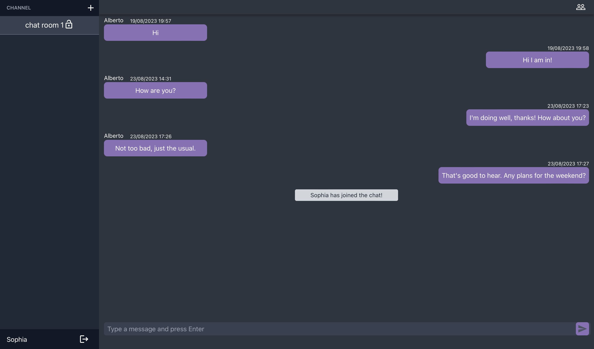

<h1>ChatApp</h1>
A straightforward group chat application that allows users to engage in real-time conversations within public or private rooms.

<h2>Features</h2><ul><li><strong>Real-time Group Chatting:</strong> Engage in lively discussions with multiple users in a single room.</li><li><strong>Public and Private Rooms:</strong> Join open public rooms for broad discussions or create private rooms for confidential chats.</li><li><strong>Simple Interface:</strong> No distractions, just conversations.</li></ul><h2>Installation</h2><ol><li>
Clone the repository:
<pre>

<code class="!whitespace-pre hljs language-bash">git clone https://github.com/suhy-jang/talk_wave.git
</code>

</pre></li><li>
Navigate to the project directory:
<pre>

<code class="!whitespace-pre hljs language-bash">cd talk_wave
</code>

</pre></li><li>
Install the required dependencies:
<pre>

<code class="!whitespace-pre hljs">npm install
</code>

</pre></li><li>
Set Up the Server: Before running the chat application, ensure you have the server set up and running. Follow the instructions in the <a href="https://github.com/suhy-jang/talk_wave_server" target="_new">talk_wave_server</a> repository. Make sure the server is running on port <code>4000</code>.
 </li><li>
Set Up Environment Variables: Create a <code>.env.development</code> file at the root of the project and set up the necessary variables:
<pre>

<code class="!whitespace-pre hljs language-bash">REACT_APP_API_URL='http://localhost:4000'
</code>

</pre></li></li><li>
Start the application:
<pre>

<code class="!whitespace-pre hljs language-sql">npm start
</code>

</pre></li></ol>
The application should now be running on <code>http://localhost:3000/</code>.
<h2>Usage</h2><ol><li><strong>Registration:</strong> Sign up with an email and password to start joining rooms.</li><li><strong>Join/Create a Room:</strong> Browse through available public rooms or create a private one.</li><li><strong>Invite Users to a Private Room:</strong> Generate and share an invite key for exclusive room access.</li><li><strong>Messaging:</strong> Type into the input field and press <code>Enter</code> to send your message.</li></ol><h2>License</h2>
This project is under the MIT License. Check out the <a href="LICENSE" target="_new">LICENSE</a> for more details.
